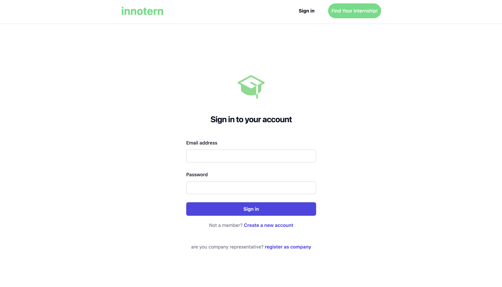
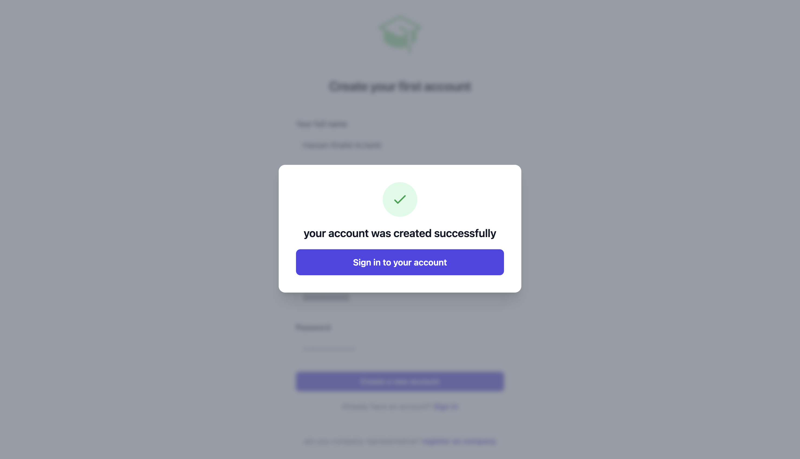
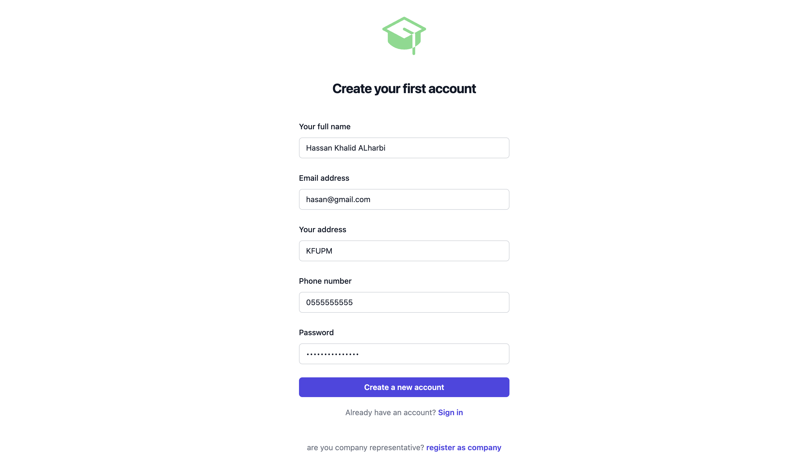
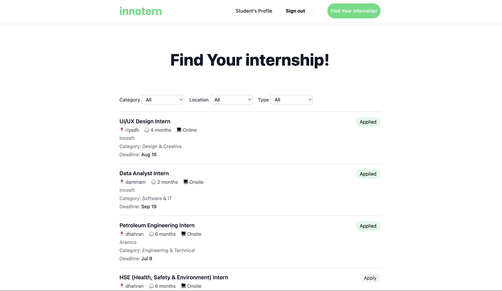
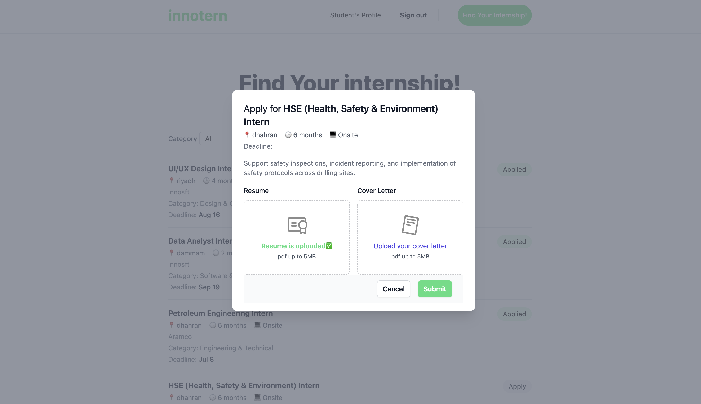
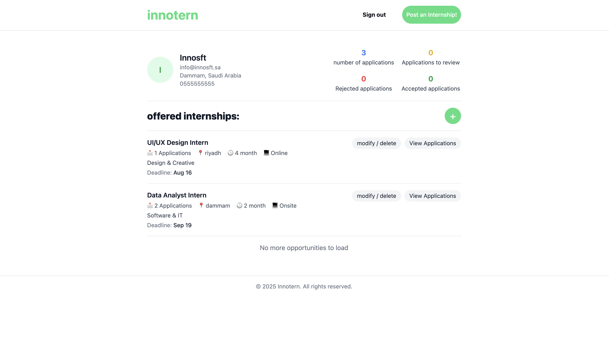
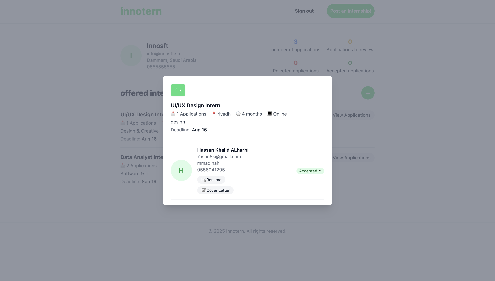
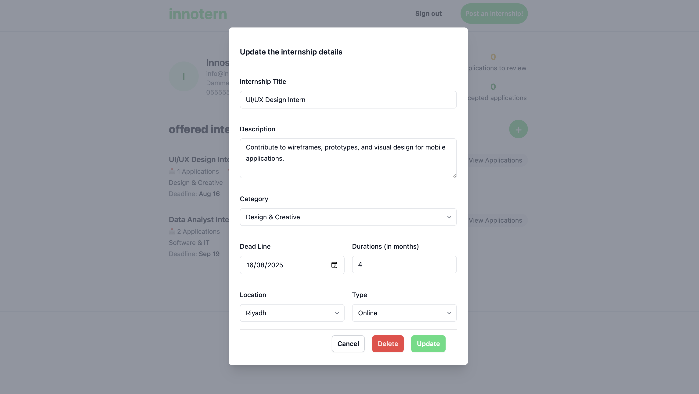
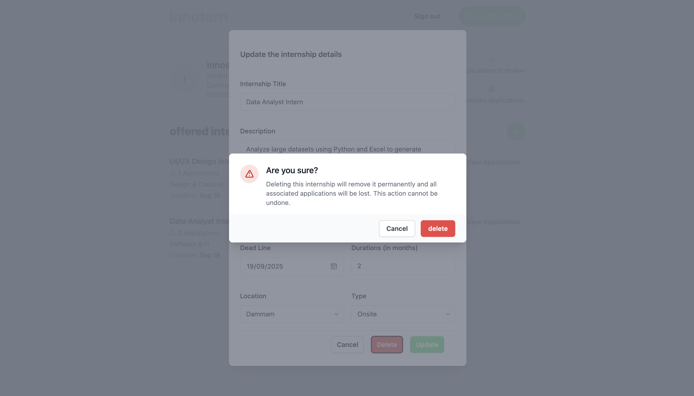

# 🎓 Innotern – Internship Management Platform

Innotern is a simple, role-based web app that connects students looking for internships with companies offering them. Students can explore available positions, apply directly, and track their application status. Companies can post internships, manage listings, and review applications.

The focus is on clean UI, smooth user experience, and clear separation between student and company access.

👤 **Roles**
- Students: Apply for internships and track applications  
- Companies: Post internships and review applicants

## 📑 Table of Contents
- [Overview](#-internhub--internship-management-platform)
- [User Roles](#user-roles)
- [✅ Features Checklist](#-features-checklist)
  - [👨‍🎓 Student Features](#-student-features)
  - [🏢 Company Features](#-company-features)
  - [⚙️ System Features](#️-system-features)
- [🚀 Getting Started](#-getting-started)
- [🧱 Tech Stack](#-tech-stack)
- [📸 Screenshots](#-screenshots)
- [🤝 Team & Contributions](#-team--contributions)
- [📝 License](#-license)

## 👥 User Roles

InternHub has two main roles:

- **Student** – apply for internships and track applications  
- **Company** – post internships and review applicants

## ✅ Features Checklist

### 👨‍🎓 Student Features
- Register and log in as a student
- Browse available internship listings
- Filter and search for internships
- View internship details
- Apply to internships with resume upload
- Track past applications status

### 🏢 Company Features
- Register and log in as a company
- Post new internship opportunities
- Edit and delete existing postings
- View list of student applications
- Review applicant details and resumes
- Change application status (e.g., Accepted, Rejected)

### ⚙️ System Features
- Fully containerized using Docker
- Frontend built with Angular
- Backend built with Django
- Uses MinIO for file storage
- PostgreSQL database

## 🚀 Getting Started

InternHub runs fully on Docker. You don't need to clone the code or build anything locally.

### 🛠 Prerequisites
- Docker installed on your machine: [Install Docker](https://docs.docker.com/get-docker/)

### 🧪 Run the Containers

You can start all three services using the following commands:

```bash
# Frontend (Angular)
docker run -p 4200:4200 7sn8k/innotern-frontend

# Backend (Django)
docker run -p 8000:8000 7sn8k/api-django

# MinIO (File Storage)
docker run -p 9000:9000 -p 9001:9001 7sn8k/minio
```

### 🌐 Access the app

- Frontend: http://localhost:4200  
- Backend API: http://localhost:8000  
- MinIO Console: http://localhost:9001

> Make sure ports `4200`, `8000`, `9000`, and `9001` are not used by other apps.

## 🧱 Tech Stack

InternHub is built using a modern, containerized full-stack setup:

### 🌐 Frontend
- **Angular** – SPA for students and companies
- **Tailwind CSS** – utility-first styling

### ⚙️ Backend
- **Django** – RESTful API and business logic
- **PostgreSQL** – relational database for users, internships, and applications

### 🗂 Storage
- **MinIO** – S3-compatible object storage used for storing resumes and cover letters

### 📦 Infrastructure
- **Docker** – all services run as containers
- Public Docker Hub images:
  - [`7sn8k/innotern-frontend`](https://hub.docker.com/r/7sn8k/innotern-frontend)
  - [`7sn8k/api-django`](https://hub.docker.com/r/7sn8k/api-django)
  - [`7sn8k/minio`](https://hub.docker.com/r/7sn8k/minio)
  - 
## 📸 Screenshots

Here's a preview of key features across both student and company perspectives:

---

### 🔐 Sign In & Account Creation

- **Signin Page**  
  

- **Account Created Confirmation**  
  

- **Logoup page Example**  
  

---

### 🎓 Student View

- **Internship Listings Page**  
  

- **Internship Application Form**  
  

- **Student Applications Dashboard**  
  

---

### 🏢 Company View

- **Company Dashboard Page**  
  

- **Submitted Applications per Internship**  
  

- **Edit / Delete Internship UI**  
  

- **Confirmation Dialog when deleting**  
  

---


## 🤝 Team & Contributions

InternHub was developed as a collaborative project. Here are the team members who brought it to life:

| Name             | Role                 |
|------------------|----------------------|
| Hasan Alharbi  | Frontend Developer   |
| Saud Alhathlool  | Backend Developer    |

> 🛑 **Note**: This project is currently not open to external contributions.

## 📝 License

This project does not yet have an open-source license.  
All rights reserved by the team.
